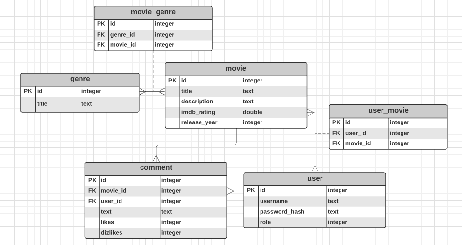
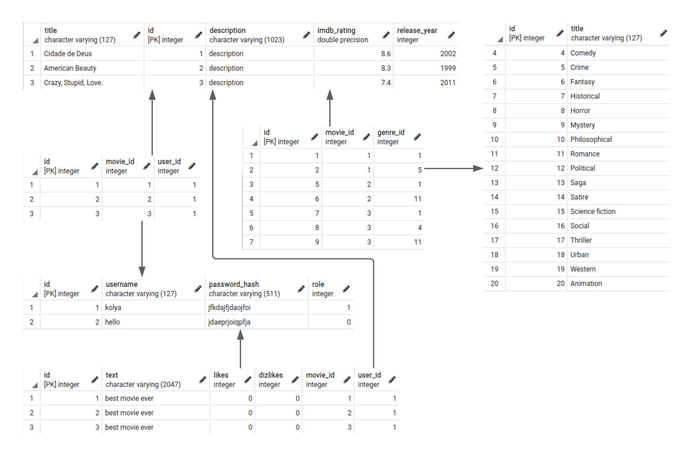

# Лабораторна №1. Проектування бази даних та ознайомлення з базовими операціями СУБД PostgreSQL

## Варіант завдання

Платформа для перегляду фільмів.

## ER diagram

## Таблиці бази даних

## Опис Структури БД 

| Сутність | Атрибут | Тип даних |
|----------|-----------|-----------|
| user | `id` - унікальний ідентифікатор користувача   `username` - ім'я користувача  `password_hash` - захешований пароль користувача   `role` - визначає рівень доступу користувача (звичайний користувач, адмін) | Int String String Int |
movie | `id` - унікальний ідентифікатор фільму `title` - назва фільму `description` - опис фільму  `imdb_rationg` - IMDB рейтинг фільму `release_year` - рік виходу фільму | Int String String Double Int |
comment |`id` - унікальний ідентифікатор коментаря до фільму `text` - текст коментаря `movie_id` - зовнішній ключ, ідентифікатор фільму `user_id` - зовнішній ключ, ідентифікатор користувача `likes` - кількість лайків коментаря `dislikes` - кількість дизлайків коментаря | Int String Int Int Int Int<body> |
genre | `id` - унікальний ідентифікатор жанру `title` - назва жанру | Int String |

